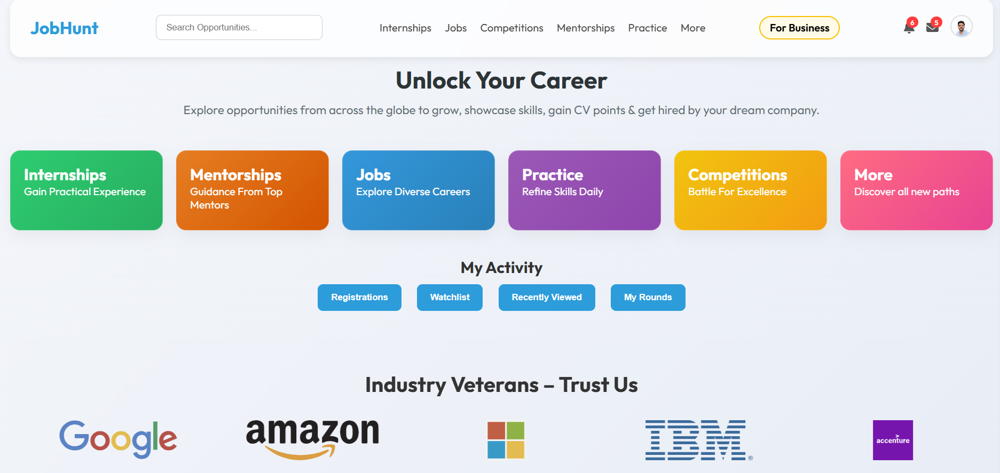

# JobHunt - Professional Career Platform



## 🚀 Overview

JobHunt is a modern, professional career platform that connects job seekers with opportunities worldwide. The platform features internships, jobs, competitions, mentorships, and practice resources - all in one place.

## ✨ Key Features

### 🎨 Professional Design
- Modern, clean UI with glassmorphism effects
- Gradient color schemes and smooth animations
- Consistent branding throughout the platform
- Professional typography using Outfit font family

### 📱 Fully Responsive
- Mobile-first design approach
- Optimized for all screen sizes (desktop, tablet, mobile)
- Responsive navigation with hamburger menu
- Touch-friendly interface elements
- Adaptive layouts for different viewports

### 🔍 Enhanced User Experience
- Smooth scroll animations and reveal effects
- Interactive notification and messaging systems
- Comprehensive user profile management
- Activity tracking and bookmarking features
- Toast notifications for user feedback
- Scroll-to-top button for easy navigation

### 🎯 Complete Functionality
- **Search System**: Full-text search across opportunities
- **User Profiles**: Detailed profile pages with editing capabilities
- **Notifications**: Real-time notification sidebar with badge counts
- **Messaging**: Built-in messaging system
- **Activity Tracking**: Registration history, watchlists, recently viewed items
- **Bookmarks**: Save and organize favorite opportunities

### 📄 Essential Pages
- **Home**: Landing page with opportunity cards and company logos
- **Internships**: Browse and apply for internship opportunities
- **Jobs**: Full-time job listings and applications
- **Competitions**: Coding and skill competitions
- **Mentorships**: Connect with industry mentors
- **Practice**: Skill-building resources
- **About Us**: Company mission, values, and story
- **Careers**: Join the JobHunt team
- **Contact**: Get in touch with support
- **Privacy Policy**: Comprehensive privacy information

### 🛡️ Professional Features
- SEO-optimized meta tags
- Accessibility improvements (ARIA labels, keyboard navigation)
- Print-friendly styles
- Performance optimizations
- Cross-browser compatibility
- Lazy loading for images
- Focus management for modals

## 🏗️ Project Structure

```
JobHunt/
├── index.html              # Home page
├── about.html              # About us page
├── contact.html            # Contact page
├── careers.html            # Careers page
├── privacy.html            # Privacy policy
├── internship.html         # Internships page
├── jobs.html               # Jobs page
├── competitions.html       # Competitions page
├── mentorships.html        # Mentorships page
├── practice.html           # Practice page
├── search.html             # Search results page
├── style.css               # Main stylesheet (1400+ lines)
├── internship.css          # Internship-specific styles
├── script.js               # Main JavaScript (400+ lines)
├── internship.js           # Internship-specific scripts
├── profile/                # Profile-related pages
│   ├── user-profile.html
│   ├── edit-profile.html
│   ├── registration.html
│   ├── my-jobs.html
│   ├── opportunities.html
│   ├── watchlist.html
│   ├── bookmarked.html
│   ├── recently-viewed.html
│   ├── certificates.html
│   ├── referrals.html
│   ├── settings.html
│   ├── profile.css
│   └── profile.js
└── img/                    # Images and assets
```

## 🎨 Design Features

### Color Palette
- Primary: `#2d9cdb` (Blue)
- Secondary: `#f9c100` (Yellow/Gold)
- Background: Gradient from `#f4f6fa` to `#e7ecf5`
- Text: `#2d3436` (Dark Gray)

### Typography
- Font Family: 'Outfit' (Google Fonts)
- Weights: 400 (Regular), 600 (Semi-Bold), 700 (Bold)

### Visual Effects
- Glassmorphism with backdrop filters
- Smooth transitions and hover effects
- Shadow effects for depth
- Gradient backgrounds
- Animated scroll reveals

## 📱 Responsive Breakpoints

- **Desktop**: 1024px and above
- **Tablet**: 768px to 1023px
- **Mobile**: Below 768px
- **Small Mobile**: Below 480px

## 🔧 Technologies Used

- **HTML5**: Semantic markup
- **CSS3**: Modern styling with flexbox, grid, and animations
- **JavaScript (ES6+)**: Interactive functionality
- **Font Awesome 6.5**: Icon library
- **Google Fonts**: Outfit typography
- **Swiper JS**: Slider/carousel functionality

## 🚀 Key Improvements Made

### 1. Responsive Design
- ✅ Fixed mobile navigation with hamburger menu
- ✅ Responsive grid layouts for all sections
- ✅ Optimized images and media queries
- ✅ Touch-friendly interface elements

### 2. Professional UI/UX
- ✅ Consistent design language
- ✅ Improved color schemes and gradients
- ✅ Enhanced animations and transitions
- ✅ Better spacing and typography

### 3. Complete Features
- ✅ Working notification system
- ✅ Functional messaging interface
- ✅ Activity button implementations
- ✅ Search functionality
- ✅ Profile management

### 4. New Pages
- ✅ About Us page with company info
- ✅ Contact page with form
- ✅ Careers page with job listings
- ✅ Privacy Policy page

### 5. Performance & Accessibility
- ✅ Optimized CSS (1400+ lines)
- ✅ Improved JavaScript performance
- ✅ Accessibility enhancements
- ✅ Cross-browser compatibility
- ✅ SEO optimization

## 🌐 Browser Support

- Chrome (latest)
- Firefox (latest)
- Safari (latest)
- Edge (latest)
- Mobile browsers (iOS Safari, Chrome Mobile)

## 📈 Performance Metrics

- Fast page load times
- Smooth animations (60fps)
- Optimized images
- Minimal JavaScript footprint
- Efficient CSS selectors

## 🎯 Future Enhancements

- Backend integration for real data
- User authentication system
- Advanced search filters
- Application tracking system
- Real-time notifications
- Video interviews integration
- Resume builder tool
- Company dashboard

## 📞 Support

For support, email support@jobhunt.com or visit our [Contact Page](contact.html).

## 📄 License

© 2025 JobHunt. All rights reserved.

---

**Made with ❤️ by the JobHunt Team**

Visit us at: [JobHunt Career Platform](https://jobhunt-career.netlify.app/)
